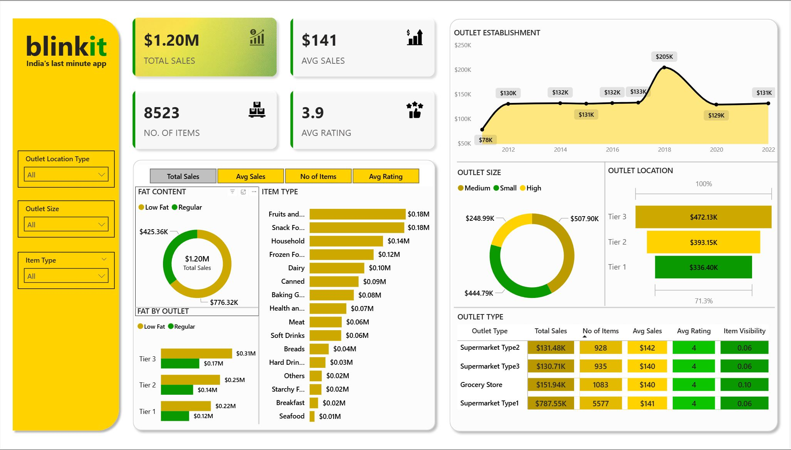
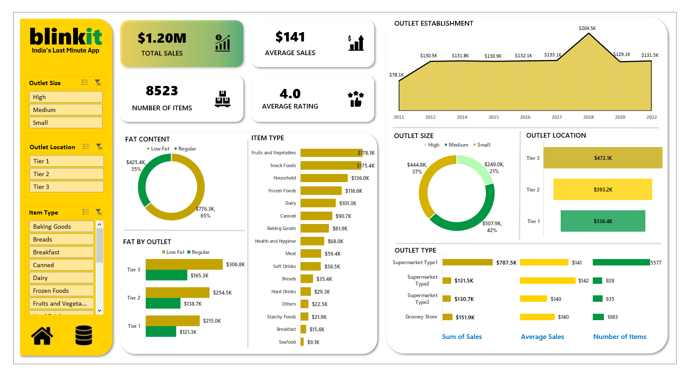

# 🛒 Blinkit Grocery Data Analysis

An end-to-end data analytics project analyzing Blinkit grocery sales data using **SQL, Python, Excel, and Power BI**.

The project focuses on understanding sales performance, product trends, outlet characteristics, and business performance through data analysis and interactive dashboards.

---

## 📊 Project Overview

This project analyzes Blinkit's grocery sales dataset to identify patterns and insights across:

- Product categories
- Fat content
- Outlet types
- Outlet sizes
- Outlet locations
- Outlet establishment years
- Sales performance
- Average sales
- Product ratings
- Item-level performance

The same dataset was analyzed using multiple tools to demonstrate an end-to-end analytics workflow.

---

## 🎯 Project Objectives

The main objectives of this project were to:

- Analyze overall sales performance
- Calculate key business KPIs
- Identify top-performing item types
- Compare sales based on product fat content
- Analyze sales across outlet locations
- Compare different outlet sizes
- Analyze sales by outlet establishment year
- Compare outlet types based on sales, items, ratings, and visibility
- Build interactive dashboards for business reporting

---

## 🛠️ Tools & Technologies

| Tool | Purpose |
|------|---------|
| **SQL** | Data exploration, cleaning, aggregation, and business analysis |
| **Python** | Data cleaning, exploratory data analysis, and visualization |
| **Excel** | Dashboard creation and interactive analysis |
| **Power BI** | Interactive business intelligence dashboard |

---

## 🔄 Project Workflow

```text
Raw Dataset
     ↓
Data Exploration & Cleaning
     ↓
SQL Analysis
     ↓
Python Exploratory Data Analysis
     ↓
Excel Dashboard
     ↓
Power BI Dashboard
     ↓
Business Insights
```

---

## 🧹 Data Cleaning

The dataset contained inconsistent values in the `Item Fat Content` column.

Values such as:

- `LF`
- `Low Fat`
- `reg`
- `Regular`

were standardized into consistent categories:

- **Low Fat**
- **Regular**

This cleaning was performed during the SQL analysis.

---

## 🗄️ SQL Analysis

The SQL analysis includes:

- Total sales calculation
- Average sales calculation
- Number of items
- Average rating
- Sales by fat content
- Sales by item type
- Top-performing item types
- Sales by outlet location
- Sales by outlet size
- Sales by outlet establishment year
- Sales by outlet type
- Average sales by outlet type
- Average rating by outlet type
- Item visibility analysis

SQL concepts used include:

- `SELECT`
- `WHERE`
- `GROUP BY`
- `ORDER BY`
- `CASE`
- `SUM()`
- `AVG()`
- `COUNT()`
- `CAST()`
- `LIMIT`
- Window functions

---

## 🐍 Python Analysis

Python was used for exploratory data analysis and visualization.

The analysis includes:

- Dataset exploration
- Data types and structure
- Data cleaning
- KPI calculations
- Sales analysis
- Fat-content analysis
- Item-type analysis
- Outlet analysis
- Outlet establishment analysis
- Outlet size analysis
- Outlet location analysis
- Data visualizations

### Python Libraries

- Pandas
- NumPy
- Matplotlib
- Seaborn

---

## 📈 Power BI Dashboard

The Power BI dashboard provides an interactive view of the Blinkit sales data.

### Key KPIs

- **Total Sales:** $1.20M
- **Average Sales:** $141
- **Number of Items:** 8,523
- **Average Rating:** ~4.0

### Dashboard Analysis

The dashboard includes:

- Sales by outlet establishment year
- Sales by fat content
- Sales by item type
- Fat content by outlet
- Sales by outlet size
- Sales by outlet location/tier
- Outlet type performance
- Interactive filters for outlet location, outlet size, and item type

### Power BI Dashboard Preview



---

## 📊 Excel Dashboard

An Excel dashboard was also created to provide an interactive view of the same dataset.

The dashboard includes:

- KPI cards
- Outlet establishment trend
- Fat content analysis
- Item type sales
- Outlet size analysis
- Outlet location analysis
- Outlet type comparison
- Interactive filters

### Excel Dashboard Preview



---

## 🔍 Key Findings

Based on the analysis and dashboards:

- Total sales are approximately **$1.20M** across **8,523 items**.
- Average sales per item are approximately **$141**.
- The average product rating is approximately **4.0**.
- **Fruits and Vegetables** and **Snack Foods** are among the highest-sales item types.
- **Tier 3 outlets** generate the highest sales among the outlet location tiers.
- **Supermarket Type1** contributes the largest share of sales among the outlet types.
- Sales show a notable peak for outlets established around **2018**.
- Low Fat products contribute a larger share of total sales than Regular products.

---

## 📁 Project Structure

```text
Blinkit-Grocery-Data-Analysis/
│
├── BlinkIT_Grocery_Data.csv
│
├── SQL/
│   └── blinkit_analysis.sql
│
├── Python/
│   └── blinkit_analysis.ipynb
│
├── PowerBI/
│   └── Blinkit Dashboard.pbix
│
├── Excel/
│   └── BlinkIT_Grocery_Dashboard.xlsx
│
└── screenshots/
    ├── powerbi_dashboard.png
    └── excel_dashboard.PNG
```

---

## 🚀 How to Use This Project

### SQL

Open:

```text
SQL/blinkit_analysis.sql
```

Run the queries in a MySQL environment using the Blinkit dataset.

### Python

Open:

```text
Python/blinkit_analysis.ipynb
```

Install the required Python libraries if necessary:

```bash
pip install pandas numpy matplotlib seaborn
```

The notebook reads the dataset from:

```text
BlinkIT_Grocery_Data.csv
```

### Power BI

Open:

```text
PowerBI/Blinkit Dashboard.pbix
```

using Microsoft Power BI Desktop.

### Excel

Open:

```text
Excel/BlinkIT_Grocery_Dashboard.xlsx
```

using Microsoft Excel.

---

## 📌 Skills Demonstrated

**Data Analysis**

- Exploratory Data Analysis
- Data Cleaning
- KPI Analysis
- Business Analysis
- Data Visualization

**SQL**

- Aggregations
- Filtering
- Grouping
- Conditional logic
- Window functions
- Business queries

**Python**

- Pandas
- NumPy
- Matplotlib
- Seaborn

**Business Intelligence**

- Power BI
- Excel Dashboards
- Interactive Filters
- KPI Reporting
- Data Visualization

---

## 👨‍💻 Author

**Archit Yadav**

B.Tech — Computer Science Engineering  
Specialization: AI/ML & Blockchain
